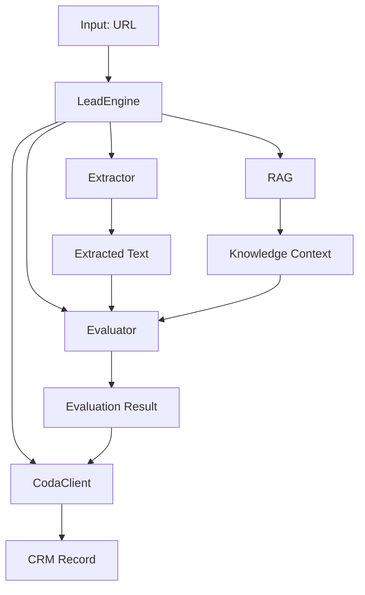

## Overview

The Lead Intelligence Engine is a **stateless, pipeline-based system** that processes business URLs through four distinct stages. Each component is independently testable and loosely coupled.

## High-Level Architecture



## Core Components

### LeadEngine (Orchestrator)

The central orchestration layer that coordinates all pipeline stages.

**Location**: `core.py`

**Responsibilities**:
- Initialize all components
- Execute pipeline stages in sequence
- Handle errors and logging
- Track latency metrics
- Return structured results

**Pipeline Flow**:

<Steps>
  <Step title="Extraction Phase">
    Calls `Extractor.process(url)` to fetch and clean website content.
    
    - Tries local BeautifulSoup extraction first
    - Falls back to Jina API for SPAs
    - Returns plain text (max 10,000 chars)
  </Step>
  
  <Step title="RAG Retrieval Phase">
    Calls `RAG.retrieve(content)` to fetch relevant knowledge.
    
    - Searches local markdown files in `knowledge/`
    - Returns top 3 matching documents
    - Continues even if RAG fails
  </Step>
  
  <Step title="Evaluation Phase">
    Calls `Evaluator.evaluate(content, rag_context)` for AI analysis.
    
    - Sends to Groq LLM with system prompt
    - Receives structured JSON response
    - Validates service names against catalog
  </Step>
  
  <Step title="CRM Sync Phase">
    Calls `CodaClient` to save results.
    
    - Checks for duplicates via `fetch_row_by_url()`
    - Inserts new row via `insert_row()`
    - Returns success or skipped status
  </Step>
</Steps>

```python core.py excerpt
class LeadEngine:
    def __init__(self):
        self.extractor = Extractor()
        self.evaluator = Evaluator()
        self.coda = CodaClient()
        self.rag = RAG()

    def process_url(self, url):
        start_time = time.time()
        
        # 1. Extraction
        extracted_data = self.extractor.process(url)
        content = extracted_data.get("text", "")
        
        # 2. RAG Retrieval
        rag_context = self.rag.retrieve(content)
        
        # 3. Evaluation
        result = self.evaluator.evaluate(content, rag_context=rag_context)
        result["url"] = url
        
        # 4. Save to Coda
        if self.coda.fetch_row_by_url(url):
            result["_status"] = "skipped"
            result["_message"] = "Duplicate found in CRM"
            return result
        
        self.coda.insert_row(result)
        result["_status"] = "success"
        result["_latency"] = f"{time.time() - start_time:.2f}s"
        
        return result
```

### Extractor

**Location**: `extractor.py`

**Purpose**: Fetches and cleans web content from URLs.

**Strategy**:
1. **Local extraction** (BeautifulSoup + requests)
   - Fast, no external dependencies
   - Works for server-rendered HTML
   - Removes scripts, styles, nav, footer

2. **Jina fallback** (r.jina.ai)
   - Triggered if local extraction < 200 chars
   - Handles SPAs and JavaScript-heavy sites
   - Returns pre-cleaned markdown

3. **Facebook routing** (Graph API)
   - Detects facebook.com URLs
   - Routes to `facebook_client.py`
   - Extracts public page data

<Info>
The extractor truncates content to 10,000 characters to stay within LLM token limits.
</Info>

### RAG System

**Location**: `rag.py`

**Purpose**: Retrieves relevant domain knowledge to enrich AI evaluation.

**Knowledge Base**: Markdown files in `knowledge/` directory:
- `Lead_q_criteria.md` - Qualification rules
- `strategy_efficiency.md` - Conversation angle framework

**Algorithm**:
- Keyword-based retrieval with intersection scoring
- Boosts for long words (>4 chars)
- Fallback for high-value terms (yangon, medical, digital, etc.)
- Returns top 3 documents by score

<Card title="RAG System Deep Dive" icon="magnifying-glass" href="/concepts/rag-system">
  Learn how knowledge retrieval works
</Card>

### Evaluator

**Location**: `evaluator.py`

**Purpose**: AI-powered business analysis and service matching.

**Features**:
- Groq LLM integration (llama-3.3-70b-versatile)
- System prompt from `prompts/system_prompt.md`
- Service catalog validation from `services/services.json`
- Token usage tracking (class-level accumulation)
- Retry logic for transient failures

**Validation**:
- Ensures `primary_service` exists in catalog
- Validates `secondary_service` if present
- Rejects responses with invalid service names

<Card title="Evaluation Pipeline" icon="robot" href="/concepts/evaluation-pipeline">
  Learn about AI evaluation and service matching
</Card>

### CodaClient

**Location**: `coda_client.py`

**Purpose**: CRM integration with duplicate prevention.

**Operations**:
- `fetch_row_by_url(url)` - Duplicate detection
- `insert_row(data)` - Create new CRM records
- `_get_columns()` - Dynamic column mapping

**Column Mapping**:
```python
{
  "Business URL": url,
  "Business Name": business_name,
  "Business Type": business_type,
  "Primary Service": primary_service,
  "Secondary Service": secondary_service,
  "Fit Score": fit_score,
  "Reasoning": reasoning,
  "Outreach Angle": outreach_angle
}
```

<Card title="Duplicate Detection" icon="copy" href="/concepts/duplicate-detection">
  Learn how URL-based deduplication works
</Card>

## User Interfaces

### CLI Interface

**Location**: `main.py`

**Usage**:
```bash
python main.py https://example.com
```

**Features**:
- Single URL processing
- Formatted JSON output
- Token usage display
- Exit codes for automation

### Telegram Bot

**Location**: `telegram_bot.py`

**Commands**:
- `/analyze <url>` - Process URL
- `/model` - Show LLM model
- `/status` - System status report

**Features**:
- Rate limiting (3 req/min per user)
- In-memory request tracking
- Async message handling
- Error recovery

<Card title="Telegram Bot Guide" icon="telegram" href="/guides/telegram-bot">
  Deploy and use the interactive bot interface
</Card>

## Design Principles

### Stateless Architecture

<Info>
No caching, no sessions, no persistence beyond Coda. Every URL is analyzed fresh.
</Info>

**Benefits**:
- Simple deployment (no database needed)
- Horizontal scaling possible
- No stale data issues
- Easy to reason about

**Trade-offs**:
- Repeated URLs consume tokens
- No performance optimization from caching

### Fail-Safe Defaults

Each component handles missing dependencies gracefully:

```python
# RAG continues if retrieval fails
try:
    rag_context = self.rag.retrieve(content)
except Exception as e:
    logger.warning(f"RAG retrieval failed: {e}")
    rag_context = []  # Continue with empty context
```

### Modular Testing

Every component can run independently:

```bash
# Test extractor
python extractor.py https://example.com

# Test RAG
python rag.py

# Test evaluator
python evaluator.py
```

## Performance Characteristics

### Latency Breakdown

Typical timing for a standard business website:

| Stage | Time | Notes |
|-------|------|-------|
| Extraction | 2-5s | Network + parsing |
| RAG Retrieval | &lt;0.1s | Local file search |
| AI Evaluation | 4-8s | Groq LLM inference |
| Coda API | 1-2s | Duplicate check + insert |
| **Total** | **7-15s** | Target: < 20s |

### Token Economics

Average per-URL consumption:

- **Prompt tokens**: 2,000-4,000
  - Website content: 1,500-3,000
  - System prompt: ~500
  - RAG context: ~500
- **Completion tokens**: 200-400
  - JSON response: ~300

**Total**: 2,500-5,000 tokens per analysis

<Warning>
Groq free tier: 7,000 RPD limit. At 5,000 tokens/request, you can analyze ~1,400 URLs per day.
</Warning>

## Configuration Files

### Environment Variables (`.env`)

```env
GROQ_API_KEY=gsk_...
CODA_API_TOKEN=...
CODA_DOC_ID=...
CODA_TABLE_ID=grid-...
TELEGRAM_BOT_TOKEN=...  # Optional
```

### Service Catalog (`services/services.json`)

Defines available services for matching:

```json
{
  "technical_services": {
    "services": [
      {
        "name": "Foundation Package",
        "category": "Website Development",
        "ideal_for": ["SMEs", "Personal Brands"],
        "use_case_signals": ["no website", "basic online presence"]
      }
    ]
  },
  "marketing_services": { ... }
}
```

### System Prompt (`prompts/system_prompt.md`)

Instructs the LLM on:
- Output format (JSON schema)
- Service matching rules
- Industry exclusions
- Fit scoring guidelines

<Card title="Configuration Guide" icon="gear" href="/guides/configuration">
  Customize services, prompts, and knowledge base
</Card>

## Error Handling

The engine uses a cascading error strategy:

<Steps>
  <Step title="Component-Level Errors">
    Each component raises exceptions with context:
    ```python
    raise Exception(f"AI Evaluation failed: {str(e)}")
    ```
  </Step>
  
  <Step title="LeadEngine Propagation">
    LeadEngine logs and re-raises:
    ```python
    except Exception as e:
        logger.error(f"LeadEngine error for {url}: {e}")
        raise e
    ```
  </Step>
  
  <Step title="Interface Handling">
    CLI and bot format errors for users:
    - CLI: `print(f"ERROR: {e}")` + sys.exit(1)
    - Bot: `await update.message.reply_text(f"Error: {e}")`
  </Step>
</Steps>

## Deployment Patterns

### Single Server

```bash
# CLI for cron jobs
0 */6 * * * cd /path/to/engine && python main.py < urls.txt

# Bot running in background
screen -dmS lead-bot python telegram_bot.py
```

### Docker Container

```dockerfile Dockerfile
FROM python:3.11-slim
WORKDIR /app
COPY requirements.txt .
RUN pip install -r requirements.txt
COPY . .
CMD ["python", "telegram_bot.py"]
```

### Multiple Workers

Stateless design allows parallel processing:

```bash
# Process 100 URLs across 10 workers
cat urls.txt | xargs -n 1 -P 10 python main.py
```

## Next Steps

<CardGroup cols={2}>
  <Card title="RAG System" icon="books" href="/concepts/rag-system">
    Deep dive into knowledge retrieval
  </Card>
  <Card title="Evaluation Pipeline" icon="brain" href="/concepts/evaluation-pipeline">
    Learn how AI evaluation works
  </Card>
  <Card title="Duplicate Detection" icon="shield-check" href="/concepts/duplicate-detection">
    Understand URL-based deduplication
  </Card>
  <Card title="API Reference" icon="code" href="/api/lead-engine">
    Explore the programmatic API
  </Card>
</CardGroup>
