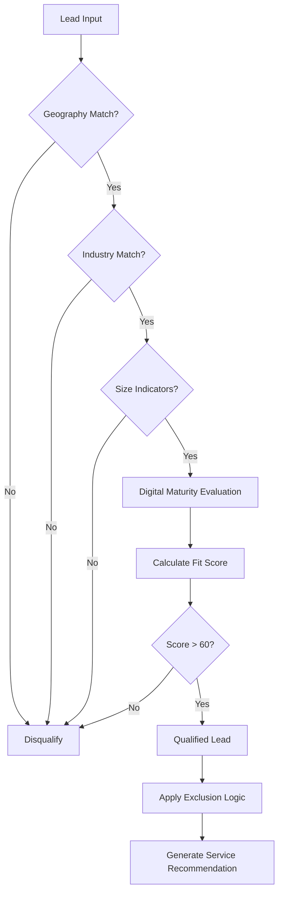

## Overview

The Lead Intelligence Engine uses multi-layered qualification criteria to identify high-potential leads. This framework combines geographic targeting, industry selection, business size indicators, and digital maturity evaluation.

## Geographic Targeting

<AccordionGroup>
  <Accordion title="Primary Markets">
    The engine targets businesses in three key markets:

    ### Yangon
    - Myanmar's commercial capital
    - High SME concentration
    - Growing digital adoption

    ### Mandalay
    - Myanmar's second-largest city
    - Strong local business ecosystem
    - Emerging digital infrastructure

    ### Bangkok
    - Regional hub
    - Mature SME market
    - Advanced digital maturity
  </Accordion>

  <Accordion title="Market Strategy">
    <Info>
      Focus on businesses with **physical presence** in these cities to ensure service delivery capability and market understanding.
    </Info>
  </Accordion>
</AccordionGroup>

## Industry Types

The system qualifies leads across seven core industries:

### Medical
<AccordionGroup>
  <Accordion title="Sub-categories">
    - Clinics
    - Dental practices
    - Skincare centers
    - Medical spas
    - Health & wellness centers
  </Accordion>

  <Accordion title="Common Needs">
    - Booking systems
    - Patient lead capture
    - Service showcase websites
    - Trust-building content
  </Accordion>
</AccordionGroup>

### Education
<AccordionGroup>
  <Accordion title="Sub-categories">
    - Private schools
    - Kindergartens
    - Tuition centers
    - Private colleges
    - Education consultants
  </Accordion>

  <Accordion title="Common Needs">
    - Enrollment systems
    - Parent communication
    - Program showcases
    - Seasonal campaign support
  </Accordion>
</AccordionGroup>

### F&B (Food & Beverage)
<AccordionGroup>
  <Accordion title="Sub-categories">
    - Restaurants
    - Cafes
    - Cloud kitchens
    - Catering services
  </Accordion>

  <Accordion title="Common Needs">
    - Online presence
    - Menu visibility
    - Location/hours information
    - Social media integration
  </Accordion>
</AccordionGroup>

### Construction
<AccordionGroup>
  <Accordion title="Common Needs">
    - Portfolio showcase
    - Project galleries
    - Trust signals
    - Contact systems
  </Accordion>
</AccordionGroup>

### Hotel & Hospitality
<AccordionGroup>
  <Accordion title="Common Needs">
    - Booking systems
    - Room showcases
    - Review management
    - Multi-language support
  </Accordion>
</AccordionGroup>

### Agencies
<AccordionGroup>
  <Accordion title="Sub-categories">
    - Real estate agencies
    - Digital marketing agencies
    - Creative agencies
  </Accordion>

  <Accordion title="Common Needs">
    - Portfolio/case studies
    - Service differentiation
    - Lead generation systems
  </Accordion>
</AccordionGroup>

### Personal Brands
<AccordionGroup>
  <Accordion title="Common Needs">
    - Portfolio websites
    - Content platforms
    - Booking/consultation systems
    - Social proof integration
  </Accordion>
</AccordionGroup>

## Industry-Specific Exclusion Logic

<Note>
  The system applies **intelligent exclusion rules** to prevent mismatched service recommendations.
</Note>

### Digital Marketing Agencies

<AccordionGroup>
  <Accordion title="Exclusion Rule">
    **DO NOT** sell "Marketing Services" or "Marketing Packages"
  </Accordion>

  <Accordion title="Allowed Services">
    - **Technology Services** (Website/Custom Development)
    - **Add-ons** (only if their own website is weak)
  </Accordion>

  <Accordion title="Reasoning">
    Marketing agencies have in-house marketing expertise. Focus on technical infrastructure gaps instead.
  </Accordion>
</AccordionGroup>

### Software/IT Companies

<AccordionGroup>
  <Accordion title="Exclusion Rule">
    **DO NOT** sell "Technology Services" (Website/Custom Development)
  </Accordion>

  <Accordion title="Allowed Services">
    - **Marketing Services**
    - **Strategy Consulting**
  </Accordion>

  <Accordion title="Reasoning">
    IT companies build their own technical solutions. Focus on marketing and strategic positioning instead.
  </Accordion>
</AccordionGroup>

### Implementation Example

```json
{
  "business_type": "Digital Marketing Agency",
  "detected_needs": ["weak website", "low posting frequency"],
  "excluded_services": ["Basic Marketing Package", "Standard Marketing Package"],
  "recommended_service": "Foundation Package",
  "reasoning": "Marketing agency with weak technical presence - recommend Foundation Package for website rebuild."
}
```

## Business Size Indicators

The engine targets **growth-stage SMEs** with specific characteristics:

<AccordionGroup>
  <Accordion title="Team Size">
    **Target**: 10–50 employees

    - Large enough to afford services
    - Small enough to need external support
    - Growth-oriented operations
  </Accordion>

  <Accordion title="Revenue Proxy">
    **Estimated Range**: ~MMK 35M

    <Info>
      This is a proxy indicator, not a hard filter. Used to identify businesses with investment capacity.
    </Info>
  </Accordion>

  <Accordion title="Business Age">
    **Target**: 2–7 years in operation

    - Past initial survival phase
    - Entering growth stage
    - Ready for optimization investment
    - Established enough for ROI measurement
  </Accordion>
</AccordionGroup>

## Digital Maturity Evaluation Framework

The system evaluates leads across **four layers** of digital maturity:

### A. Visibility Layer

<AccordionGroup>
  <Accordion title="Signals to Detect">
    - **Posting frequency**: How often they publish content
    - **Engagement ratio**: Likes, comments, shares relative to followers
    - **Paid ads presence**: Active advertising campaigns
    - **Website existence**: Own domain vs. social-only
  </Accordion>

  <Accordion title="Risk Flags">
    - High engagement but **no visible CTA**
    - Boosted posts without **structured funnel**
    - Strong attention but weak conversion path
  </Accordion>
</AccordionGroup>

### B. Website Evaluation

<AccordionGroup>
  <Accordion title="Positive Signals">
    - Lead capture form exists
    - Booking system present
    - CTA clarity
    - Contact info visibility
    - Mobile optimization
    - Pixel/tracking scripts detected
  </Accordion>

  <Accordion title="Risk Flags">
    - **Brochure-only website**: No conversion mechanism
    - **No clear action path**: Visitors don't know what to do
    - Poor mobile experience
    - Missing contact information
  </Accordion>
</AccordionGroup>

<Info>
  A "brochure website" displays information but lacks lead capture, booking, or clear CTAs - common gap for growth-stage SMEs.
</Info>

### C. Measurement Signals

<AccordionGroup>
  <Accordion title="Detection Points">
    - **Meta Pixel**: Facebook/Instagram conversion tracking
    - **GA4**: Google Analytics 4 implementation
    - **Tag Manager**: Google Tag Manager presence
    - **Conversion event triggers**: Custom event tracking
  </Accordion>

  <Accordion title="Risk Flags">
    - **No tracking scripts**: Flying blind on performance
    - **No visible funnel tracking**: Can't measure ROI
    - Ads running without measurement
  </Accordion>
</AccordionGroup>

```json
{
  "measurement_maturity": {
    "meta_pixel": false,
    "ga4": false,
    "tag_manager": false,
    "maturity_level": "low",
    "recommended_angle": "Revenue Visibility Gap"
  }
}
```

### D. Operational Maturity

<AccordionGroup>
  <Accordion title="Positive Signals">
    - **Automated booking confirmation**: System-generated responses
    - **Structured FAQ system**: Self-service support
    - **Chatbot presence**: Automated initial engagement
    - **Email capture**: Building owned audience
  </Accordion>

  <Accordion title="Risk Flags">
    - **Messenger-only communication**: Platform dependency
    - **Manual phone-based booking**: Operational bottleneck
    - No automated follow-up
    - Purely reactive customer service
  </Accordion>
</AccordionGroup>

<Note>
  **Messenger-only businesses** are highly vulnerable to platform changes and have limited scalability.
</Note>

### E. Asset Ownership Check

<AccordionGroup>
  <Accordion title="Owned Assets to Check">
    - **Owned domain**: Own website vs. Facebook page only
    - **Email list capture**: Building owned audience
    - **SEO pages**: Organic search visibility
    - **Google Business presence**: Local search optimization
  </Accordion>

  <Accordion title="Risk Flags">
    - **Facebook-only business**: Zero owned digital assets
    - No email list
    - No search presence
    - Complete platform dependency
  </Accordion>
</AccordionGroup>

```json
{
  "asset_ownership": {
    "owned_domain": false,
    "email_capture": false,
    "seo_presence": false,
    "google_business": true,
    "risk_level": "high",
    "recommended_angle": "Platform Dependency Risk"
  }
}
```

## Maturity Scoring Example

```json
{
  "business_name": "Sunrise Dental Clinic",
  "location": "Yangon",
  "industry": "Medical - Dental",
  "maturity_evaluation": {
    "visibility_layer": {
      "posting_frequency": "3-4x per week",
      "engagement_ratio": "high",
      "paid_ads": true,
      "website_exists": true,
      "score": 75
    },
    "website_evaluation": {
      "lead_capture": false,
      "booking_system": false,
      "cta_clarity": "weak",
      "mobile_optimized": true,
      "tracking_scripts": false,
      "score": 40,
      "flag": "brochure-only website"
    },
    "measurement_signals": {
      "meta_pixel": false,
      "ga4": false,
      "score": 0,
      "flag": "no tracking infrastructure"
    },
    "operational_maturity": {
      "booking_automation": false,
      "chatbot": false,
      "email_capture": false,
      "score": 20,
      "flag": "messenger-only communication"
    },
    "asset_ownership": {
      "owned_domain": true,
      "email_list": false,
      "seo_presence": "weak",
      "google_business": true,
      "score": 50
    }
  },
  "overall_maturity": "medium-low",
  "primary_gap": "Conversion Infrastructure",
  "fit_score": 88
}
```

## Qualification Decision Flow



<Info>
  Leads must pass **all qualification gates** before digital maturity evaluation and service matching.
</Info>
