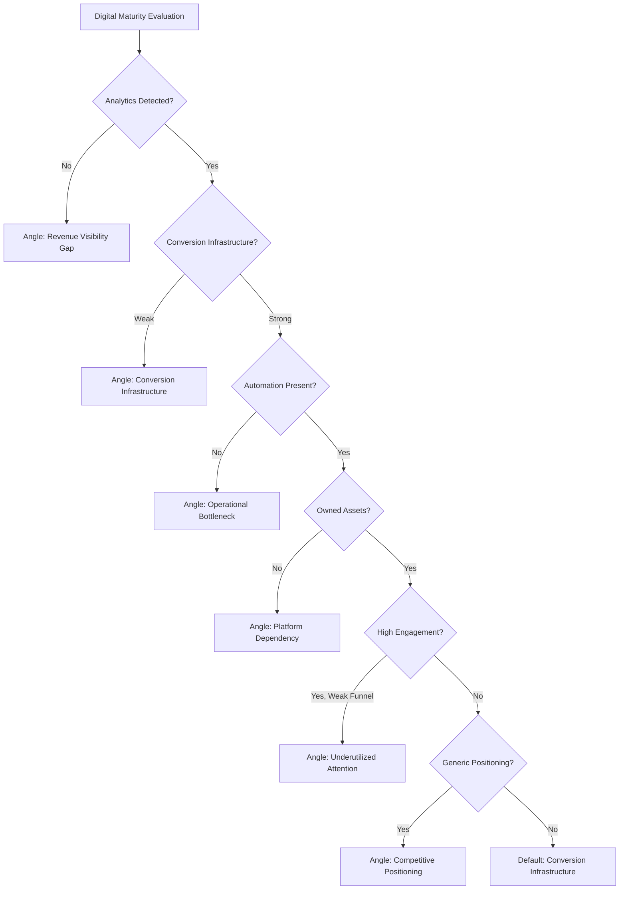

## Overview

The Strategy Framework is the **intelligence layer** that transforms qualified lead data into strategic conversation entry points. This is not outreach copy - it's strategic framing intelligence.

<Note>
  **Core Purpose**: After evaluating a business profile, the system generates a predicted conversation entry angle based on observable structural inefficiencies.
</Note>

## Core Philosophy

### Efficiency-First Principles

<AccordionGroup>
  <Accordion title="We Do Not Assume Problems">
    The system **infers structural inefficiencies** based on observable signals, not assumptions.

    **Example**:
    - ❌ "Your website probably doesn't convert well"
    - ✅ "No lead capture form detected + active paid ads = conversion gap"
  </Accordion>

  <Accordion title="We Do Not Sell Services">
    The system **identifies leverage points** - the highest-impact opportunity for growth.

    **Example**:
    - ❌ "You need a new website"
    - ✅ "Website exists but lacks conversion infrastructure - traffic is being wasted"
  </Accordion>

  <Accordion title="Strategic Entry Point">
    The output must answer:

    > "If we were to start a strategic discussion, what is the most logical entry point?"

    This focuses conversations on **structural opportunities**, not service features.
  </Accordion>
</AccordionGroup>

<Info>
  **Fundamental Principle**: Every SME problem visible externally is a surface signal of a structural system gap. The goal is to identify the most economically meaningful system gap.
</Info>

## Angle Selection Hierarchy

Angles are selected based on **highest structural risk** to the business. The system evaluates in priority order:

```
1. Revenue Visibility Gap
2. Conversion Infrastructure Weakness  
3. Operational Bottleneck
4. Platform Dependency Risk
5. Underutilized Attention
6. Competitive Positioning Gap
```

<Note>
  The system selects the **first matching angle** from this hierarchy based on detected signals.
</Note>

## Angle Definitions

### 1. Revenue Visibility Gap

<AccordionGroup>
  <Accordion title="Trigger Conditions">
    - No analytics detected
    - No conversion tracking
    - Ads visible but no measurable funnel
    - No data signals present
  </Accordion>

  <Accordion title="Predicted Conversation Direction">
    Discussion about **measurable growth and revenue clarity**
  </Accordion>

  <Accordion title="Core Framing">
    > "Your growth decisions may not be tied to real performance data."
  </Accordion>

  <Accordion title="Strategic Depth">
    Focus areas:
    - **CAC** (Customer Acquisition Cost) visibility
    - **LTV** (Lifetime Value) tracking
    - Tracking architecture implementation
    - Decision confidence improvement
  </Accordion>
</AccordionGroup>

#### Example Output

```json
{
  "angle": "Revenue Visibility Gap",
  "detected_signals": [
    "no_analytics",
    "ads_running",
    "no_pixel",
    "no_conversion_tracking"
  ],
  "strategic_entry_point": "Your paid advertising lacks measurable funnel tracking - growth decisions are being made without performance data.",
  "opportunity_leverage": "Implementing conversion tracking unlocks data-driven optimization and predictable ROI.",
  "priority": 1
}
```

### 2. Conversion Infrastructure Weakness

<AccordionGroup>
  <Accordion title="Trigger Conditions">
    - Website exists
    - No lead capture present
    - Weak or unclear CTAs
    - No booking automation
    - High engagement but low structural conversion path
  </Accordion>

  <Accordion title="Predicted Conversation Direction">
    Discussion about **converting existing traffic into measurable revenue**
  </Accordion>

  <Accordion title="Core Framing">
    > "Attention exists, but the system converting it into revenue may be incomplete."
  </Accordion>

  <Accordion title="Strategic Depth">
    Focus areas:
    - Landing structure optimization
    - Funnel design implementation
    - CTA optimization
    - Lead capture mechanisms
  </Accordion>
</AccordionGroup>

#### Example Output

```json
{
  "angle": "Conversion Infrastructure",
  "detected_signals": [
    "website_exists",
    "no_lead_capture",
    "weak_cta",
    "high_social_engagement"
  ],
  "strategic_entry_point": "Strong social engagement is driving traffic, but your website lacks conversion infrastructure to capture that attention.",
  "opportunity_leverage": "Adding structured conversion paths turns existing attention into predictable lead flow.",
  "priority": 2
}
```

### 3. Operational Bottleneck

<AccordionGroup>
  <Accordion title="Trigger Conditions">
    - Messenger-only communication
    - Manual booking processes
    - No automation signals
    - No structured follow-up system
  </Accordion>

  <Accordion title="Predicted Conversation Direction">
    Discussion about **operational scalability and efficiency**
  </Accordion>

  <Accordion title="Core Framing">
    > "Growth may be constrained by manual processes."
  </Accordion>

  <Accordion title="Strategic Depth">
    Focus areas:
    - Automation implementation
    - CRM integration
    - Response time optimization
    - Scalability infrastructure
  </Accordion>
</AccordionGroup>

#### Example Output

```json
{
  "angle": "Operational Bottleneck",
  "detected_signals": [
    "messenger_only",
    "manual_booking",
    "no_automation"
  ],
  "strategic_entry_point": "All bookings are handled manually through Messenger - this creates a scaling ceiling as demand grows.",
  "opportunity_leverage": "Automated booking and follow-up systems remove manual constraints and enable predictable growth.",
  "priority": 3
}
```

### 4. Platform Dependency Risk

<AccordionGroup>
  <Accordion title="Trigger Conditions">
    - Facebook-only presence
    - No owned domain
    - No email capture mechanism
    - No SEO footprint
  </Accordion>

  <Accordion title="Predicted Conversation Direction">
    Discussion about **digital asset ownership and risk mitigation**
  </Accordion>

  <Accordion title="Core Framing">
    > "Current growth relies on rented platforms."
  </Accordion>

  <Accordion title="Strategic Depth">
    Focus areas:
    - Digital equity building
    - Asset control establishment
    - Long-term stability
    - Platform risk mitigation
  </Accordion>
</AccordionGroup>

#### Example Output

```json
{
  "angle": "Platform Dependency Risk",
  "detected_signals": [
    "facebook_only",
    "no_owned_domain",
    "no_email_list"
  ],
  "strategic_entry_point": "Your entire digital presence exists on Facebook - algorithm changes or policy updates could impact your visibility overnight.",
  "opportunity_leverage": "Building owned digital assets creates stability and long-term equity independent of platform changes.",
  "priority": 4
}
```

<Info>
  **Platform Dependency** is particularly critical for businesses in markets with frequent social media disruptions or policy changes.
</Info>

### 5. Underutilized Attention

<AccordionGroup>
  <Accordion title="Trigger Conditions">
    - Strong engagement metrics
    - Active posting schedule
    - Weak conversion infrastructure
    - No structured funnel
  </Accordion>

  <Accordion title="Predicted Conversation Direction">
    Discussion about **amplifying existing attention into predictable acquisition**
  </Accordion>

  <Accordion title="Core Framing">
    > "There is visible demand, but it is not fully captured."
  </Accordion>

  <Accordion title="Strategic Depth">
    Focus areas:
    - Funnel layering
    - Retargeting implementation
    - Audience segmentation
    - Attention monetization
  </Accordion>
</AccordionGroup>

#### Example Output

```json
{
  "angle": "Underutilized Attention",
  "detected_signals": [
    "high_engagement",
    "active_posting",
    "weak_funnel"
  ],
  "strategic_entry_point": "Your content generates strong engagement, but this attention isn't being systematically converted into customer acquisition.",
  "opportunity_leverage": "Structured funnel architecture transforms existing attention into predictable revenue streams.",
  "priority": 5
}
```

### 6. Competitive Positioning Gap

<AccordionGroup>
  <Accordion title="Trigger Conditions">
    - Highly saturated industry
    - Generic messaging
    - No visible differentiation
    - Copy-based positioning (copying competitors)
  </Accordion>

  <Accordion title="Predicted Conversation Direction">
    Discussion about **structural differentiation and defensibility**
  </Accordion>

  <Accordion title="Core Framing">
    > "Increased competition requires systematic positioning."
  </Accordion>

  <Accordion title="Strategic Depth">
    Focus areas:
    - Offer clarity
    - Category positioning
    - Strategic branding
    - Differentiation framework
  </Accordion>
</AccordionGroup>

#### Example Output

```json
{
  "angle": "Competitive Positioning Gap",
  "detected_signals": [
    "saturated_industry",
    "generic_messaging",
    "no_differentiation"
  ],
  "strategic_entry_point": "In a saturated dental market, your positioning mirrors competitors - making price the default differentiator.",
  "opportunity_leverage": "Strategic positioning creates defensible differentiation that commands premium pricing.",
  "priority": 6
}
```

## Output Structure

After evaluation, the system generates a complete strategic profile:

### Business Snapshot

```json
{
  "business_snapshot": {
    "industry": "Medical - Dental Clinic",
    "location": "Yangon",
    "digital_maturity_level": "medium-low"
  }
}
```

### Primary Structural Gap

Single highest-impact inefficiency identified:

```json
{
  "primary_structural_gap": "Conversion Infrastructure Weakness"
}
```

### Predicted Conversation Angle

One of the six defined angles:

```json
{
  "predicted_angle": "Conversion Infrastructure"
}
```

### Strategic Entry Point

One sentence describing how the discussion should begin:

```json
{
  "strategic_entry_point": "Your website receives traffic from social media and ads, but lacks lead capture mechanisms - attention is being wasted."
}
```

### Opportunity Leverage Statement

One sentence describing what unlocks growth:

```json
{
  "opportunity_leverage": "Implementing structured conversion paths transforms existing traffic into predictable lead generation."
}
```

## Complete Example Output

```json
{
  "business_snapshot": {
    "business_name": "Bright Smile Dental Clinic",
    "industry": "Medical - Dental",
    "location": "Yangon",
    "digital_maturity_level": "medium"
  },
  "primary_structural_gap": "Conversion Infrastructure Weakness",
  "predicted_conversation_angle": "Conversion Infrastructure",
  "strategic_entry_point": "Active social presence drives website traffic, but no booking system or lead capture exists - each visitor must call manually.",
  "opportunity_leverage": "Automated booking infrastructure removes friction and converts existing attention into scheduled appointments.",
  "detected_signals": [
    "website_exists",
    "no_booking_system",
    "high_social_engagement",
    "manual_phone_booking",
    "no_lead_capture"
  ],
  "angle_priority": 2,
  "outreach_angle": "Start conversation around operational efficiency and conversion optimization rather than website redesign."
}
```

## Language Rules for Generated Angles

### Tone Requirements

<AccordionGroup>
  <Accordion title="Analytical">
    Base all statements on observable data and structural analysis.

    ✅ "No conversion tracking detected"
    ❌ "You're probably losing customers"
  </Accordion>

  <Accordion title="Neutral">
    Avoid emotional triggers and pressure language.

    ✅ "Manual processes may constrain scaling"
    ❌ "You're falling behind competitors!"
  </Accordion>

  <Accordion title="Structured">
    Use frameworks and systematic thinking.

    ✅ "Visibility exists but conversion infrastructure is incomplete"
    ❌ "Your website needs work"
  </Accordion>

  <Accordion title="Non-Assumptive">
    State observations, not assumptions about internal operations.

    ✅ "No email capture mechanism detected"
    ❌ "You don't care about building an audience"
  </Accordion>
</AccordionGroup>

### Vocabulary Framework

**Preferred Terms**:
- Infrastructure
- Visibility
- Optimization
- Leverage
- Scalability
- Architecture
- Efficiency
- System
- Framework
- Structural

**Avoid**:
- Emotional triggers ("urgent", "critical", "disaster")
- Pressure language ("must", "need to", "should")
- Sales phrasing ("amazing deal", "limited time")
- Hype framing ("revolutionary", "game-changer")

### Example Comparison

| ❌ Avoid | ✅ Use |
|---------|--------|
| "Your website is terrible!" | "Website lacks conversion infrastructure" |
| "You're losing customers every day!" | "No lead capture mechanism detected" |
| "You need our services now!" | "Conversion infrastructure gap identified" |
| "This is a disaster!" | "Structural inefficiency in booking process" |
| "Everyone else is doing this!" | "Standard conversion optimization approach" |

## What This Framework Is NOT

<Note>
  **Critical Understanding**: This framework generates strategic intelligence, not sales materials.
</Note>

- ❌ **Not a sales script**: These are analytical insights, not persuasive copy
- ❌ **Not a pitch**: No service promotion or feature listing
- ❌ **Not a marketing proposal**: No pricing or package details
- ❌ **Not persuasion copy**: No emotional manipulation or urgency tactics

<Info>
  This is **pre-conversation strategic intelligence** - it informs how a conversation should be framed, not what words should be said.
</Info>

## Angle Selection Flow



## Integration with Service Matching

The strategic angle **informs** but does not **determine** service selection:

```json
{
  "strategic_angle": "Revenue Visibility Gap",
  "primary_service": "Standard Marketing Package",
  "reasoning": "Angle identifies tracking need, but business lacks content foundation - must build content infrastructure before advanced tracking.",
  "conversation_approach": "Begin with visibility and tracking discussion, but recommend content foundation first."
}
```

<Info>
  Strategic angles create **conversation context**, while service matching handles **tactical recommendations**. Both work together to create coherent outreach strategy.
</Info>
